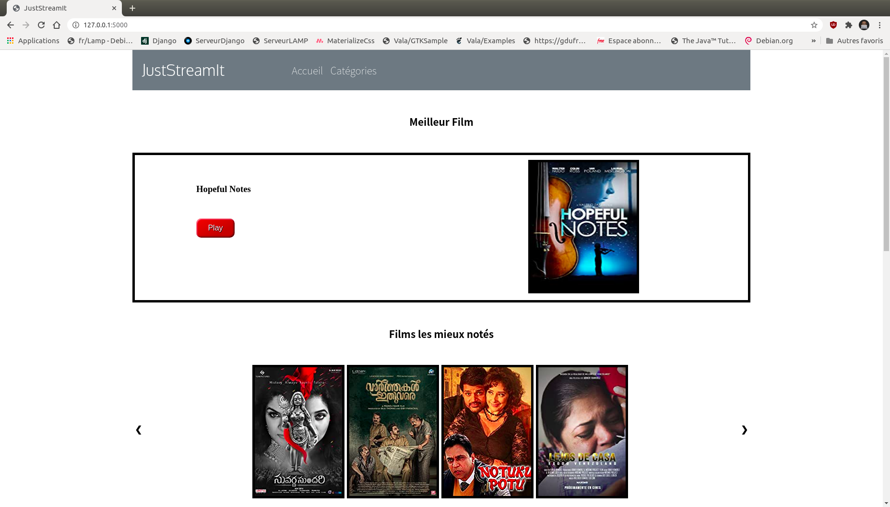

# Projet_P6
## Développez une interface utilisateur pour une application web Python
### 1) Description de l'application

Ce projet consiste à développer une interface utilisateur (un site web) permettant de visualiser en temps réel un classement de films intéressants pour le compte de l'association JustStreamIt.

Les données restituées par le site web sont récupérées via une API maison baptisée OCMovies-API.

#### Schéma d'architecture globale de l'application

L'application se lance à partir du programme run.py situé à la racine du projet.

L'url d'accès à l'application est http://127.0.0.1:5000/

En cliquant sur ce lien, le serveur Flask lance le programme views.py situé dans le répertoire `jsiapp` (voir organisation du code plus bas).

Compte-tenu de l'url, le programme views.py retourne la page index.html situé dans le répertoire `jsiapp/templates` (voir organisation du code plus bas).

#### Organisation du code de l'application

Le code HTML, CSS et Javascript est organisé de la manière suivante :

* Le dossier `jsiapp/templates` contient les pages html de l'application
* Le dossier `jsiapapp/static` contient les ressources statiques (ou locales) appelées par le code HTML (CSS, Javacript, images ou icônes) :
    * dans le sous-dossier `css`, on retrouve le code CSS
    * dans le sous-dossier `icons`, on retrouve les icônes (format svg)
    * enfin dans le sous-dossier `js`, se trouve le code Javascript

Les données à restituer sont hébergées sur le serveur OCMovies-API.
Pour les récupérer, l'application utilise l'API Fetch en langage Javascript asynchrone.

#### GitFlow du projet

Les branches du projet :

* Branche de développement `p6_dev`
* Branche 'main' et 'master' : version finale

### 2) Installation du serveur de données OCMovies-API sur votre machine

Les instructions d'installation du serveur de données OCMovies-API se trouvent dans le fichier README.md du dépot github suivant : https://github.com/OpenClassrooms-Student-Center/OCMovies-API-EN-FR

Je recommande la deuxième méthode d'installation :

**Installation et exécution de l'application sans pipenv (avec venv et pip)**

### 3) Installation du projet Projet_P6 sur votre machine

Sur votre machine créer un dossier dans lequel vous allez installer le projet.
On nommera par exemple ce dossier `projects`. (vous pouvez le nommer autrement, c'est juste pour avoir une référence dans la suite des explications)

Aller sur le dépôt github : https://github.com/yannis971/Projet_P6

Pour l'installation, il y a 2 méthodes possibles.

#### 3.1) Première méthode : Téléchargement du fichier zip

Dans l'onglet **<> Code** de la page ci-dessus, cliquer sur le bouton **Code** puis sur **Download ZIP**

Placer le fichier zip dans le dossier `projects` et le dézipper.

Ouvrir un terminal et se déplacer dans la racine du projet dossier '`projects/Projet_P6-main/`'

Passer à l'étape 4 pour configurer l'environnement virtuel

#### 3.2) Deuxième méthode : Clonage du dépôt avec git

Sur la figure précédente, copier le lien https : https://github.com/yannis971/Projet_P6.git

Ouvrir un terminal et se déplacer dans le dossier `projects` créé précédemment et taper la commande :

`git clone` suivi du lien https copié plus haut.

soit : `git clone https://github.com/yannis971/Projet_P6.git`

Se déplacer dans la racine du projet : dossier `projects/Projet_P6`

Passer à l'étape 4 pour configurer l'environnement virtuel

### 4) Configuration de l'environnement virtuel

#### Remarque

Les commandes ci-dessous (notamment celles concernant l'installation de pip pour python3) sont valables sur un système d'exploitation Linux de type Debian ou de ses dérivés.

Pour Windows, on utilise python et pip.

Pour Mac OS, on utilise python3 et pip3.

#### 4.1) Installer pip pour python3 si ce n'est pas déjà fait

Si la commande `pip3 --version` renvoie une erreur alors il convient d'installer pip

`sudo apt-get update && sudo apt-get install python3-pip`

Si l'installation a réussi, la commande vous renverra une ligne comme indiqué ci-dessous
`pip 20.2.3 from /home/yannis/.local/lib/python3.8/site-packages/pip (python 3.8)`

#### 4.2) Créer un environnement virtuel et l'activer

Se placer à la racine du projet (dossier dans lequel se trouve le fichier run.py) et lancer la commande :

`python3 -m venv env`

Une fois l'environnement virtuel  `env` créé, l'activer avec la commande :

`source env/bin/activate`

#### 4.3) Installer les dépendances du projet

Toujours à la racine du projet, lancer l'une des 2 commandes suivantes :

`pip3 install -r requirements.txt`

`python3 -m pip install -r requirements.txt`

### 5) Exécution

#### 5.1) Lancer le serveur de données OCMovies-API

Il faut d'abord démarrer le serveur de données.

Dans le réprtoire ou est installé le projet ocmovies-api, taper la commande `source env/bin/activate && python3 manage.py runserver`.

#### 5.2) Lancer le serveur d'application Projet_P6

Une fois le serveur de données démarré, se déplacer dans la racine du projet : répertoire `projects/Projet_P6`

Taper la commande `source env/bin/activate && python3 run.py`.

Ouvrir un navigateur et taper l'url : http://127.0.0.1:5000/

La page web JustStreamIt s'affiche dans votre navigateur.

Ci-après quelques captures d'écran.

### 6) Licence

Le code de ce projet est sous licence libre **GNU GPL V3**

### 7) Questions/Aide/Support

En cas de problèmes ou pour questions relatives à ce projet, vous pouvez me contacter via l'un des canaux suivants :

* e-mail : yannis.saliniere@gmail.com

* twitter : https://twitter.com/YSaliniere

* rubrique "issues" du projet github : https://github.com/yannis971/Projet_P6/issues
